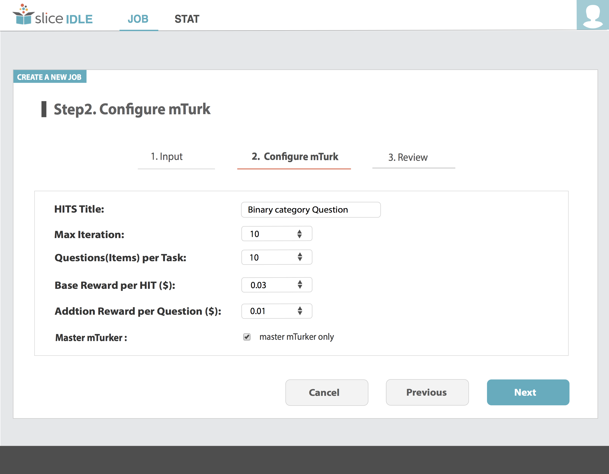

# IDLE

This repository shows the screen shots of IDLE system in 2017 CIKM Demo Track.

## Abstract

Researchers and scientists have been using crowdsourcing platforms to collect labeled training data in recent years. The process is cost-effective and scalable, but research has shown that the quality of truth inference is unstable due to worker bias, work variance, and task difficulty. In this demonstration, we present a hybrid system, named IDLE (Integrated Data Labeling Engine), that brings together a well-trained troop of domain experts and the multitudes of a crowdsourcing platform to collect high-quality training data for Slice Technologies'  classification engine. We show how to acquire high quality labeled data through quality control strategies that dynamically and cost-effectively leverage the strengths of both domain experts and crowdsourcing.

## Manual

### Data Ingestion

### Crowdsourcing Job Configuration

### Crowdsourcing Job Creation

### Stats Reporting

## License

&copy; 2017 Slice Technologies, Inc. All Rights Reserved.
